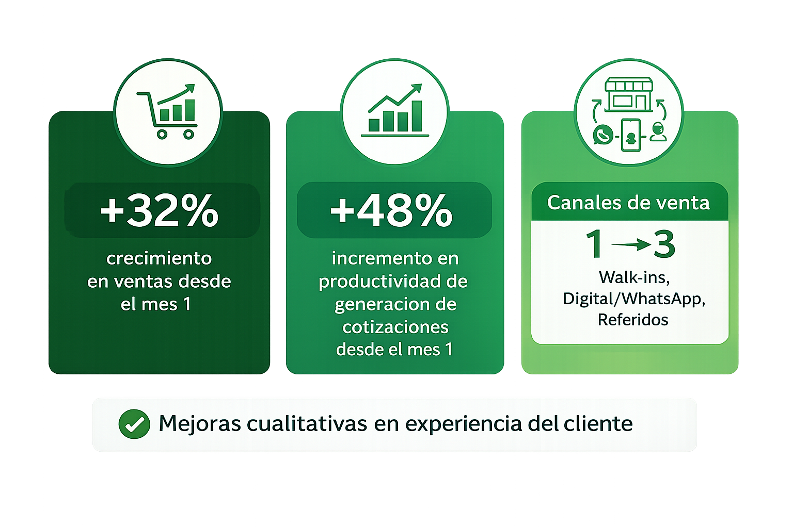

<a href="https://wa.me/525559446719?text=Hola%2C%20me%20gustar%C3%ADa%20agendar%20un%20diagn%C3%B3stico%20para%20aumentar%20las%20Ventas%20de%20mi%20empresa..." style="display: inline-block; background-color: #25D366; color: black; padding: 12px 24px; text-decoration: none; border-radius: 8px; font-weight: bold; margin: 20px 0;">Solicitar diagnóstico de Ventas</a>

## El Cliente

Tendenzza es una empresa de interiorismo con más de 27 años en el mercado, especializada en diseño e instalación de espacios residenciales a medida—cocinas integrales, closets, recámaras y baños—con presencia en CDMX a través de sus showrooms en Miramontes, Colonia del Valle y Pedregal. Su enfoque combina estética, funcionalidad y ejecución detallada para transformar hogares con proyectos integrales de alta calidad.

## Problema

### Márgenes inestables
Los precios se ponían sin una referencia clara de utilidad, generando resultados inconsistentes entre proyectos.

### Variabilidad en la atención
Cada asesor vendía a su manera. Sin un proceso común, la presentación de productos y el avance hacia la decisión era irregular.

### Canales subutilizados 
Se dependía de un solo canal de venta; cuando ese canal se frenaba, también se frenaban las ventas.

### Negociación sin estrategia  
Sin una forma clara de negociar y persuadir, se recurría a descuentos innecesarios que reducían la ganancia y debilitaban los cierres.

### Seguimiento débil a clientes fríos
Clientes que habían recibido atención se quedaban sin seguimiento y no se les volvía a contactar, dejando ventas en pausa que terminaban perdiéndose.

### Sin segmentación ni Journey  
Se seguía el mismo camino con todos los clientes, aunque tuvieran necesidades distintas, lo que alargaba decisiones y dejaba ventas en el camino.

 
 

# Journey de la Solución
## Negociación Sistematizada

Iniciamos con un *diagnóstico en sitio* y una *auditoría de interacciones comerciales* (piso, llamadas, WhatsApp y cotizaciones) para mapear el journey real, identificar fugas y documentar variabilidad operativa. Con base en un *benchmark competitivo*, definimos la lógica de valor y los elementos diferenciadores que debían estandarizarse en el discurso. A partir de ahí diseñamos un *marco de pricing y gobernanza comercial*: precio de lista con costos relevantes integrados, niveles de descuento con reglas explícitas por escenario y una modalidad de pago híbrida (MSI + contado). El objetivo fue convertir la negociación en un proceso controlado por reglas y no por criterios individuales, habilitando ejecución consistente en el punto de venta.

## Scripts de alto impacto

Tradujimos el diagnóstico en un *modelo de ejecución comercial* compuesto por scripts para los momentos críticos del proceso. Desarrollamos guiones específicos por contexto (walk-ins con/sin medidas, inbound/WhatsApp, referidos y reactivación), todos alineados a una misma lógica: *apertura, diagnóstico, conducción, manejo de objeciones, definición de siguiente paso y seguimiento*. Los scripts se construyeron con un enfoque iterativo: diseño inicial, prueba operativa, ajustes por usabilidad y estandarización final, garantizando consistencia entre canales y reduciendo la dependencia de “estilos” individuales.

## Capacitaciónes

Implementamos un esquema de *habilitación y control de adopción* basado en práctica: role plays estructurados, simulaciones por escenario y evaluación contra criterios de ejecución. El contenido se organizó en tres frentes: (1) operación del sistema y aplicación de scripts, (2) habilidades de showroom premium (presencia, preguntas de diagnóstico, persuasión), y (3) negociación y manejo de objeciones con enfoque en siguiente paso. El objetivo fue asegurar transferencia operativa: que el equipo ejecute el modelo con consistencia, no solo que lo entienda.

## Plan de Incentivos

Diseñamos un *modelo de incentivos* alineado al sistema para reforzar comportamientos y disciplina operativa, evitando desalineaciones típicas (premiar volumen sin proceso). El esquema se estructuró con componentes individual y por equipo, con escalones definidos, y se validó con vendedores y dirección para asegurar claridad, viabilidad y gobernanza. El objetivo fue que el sistema tenga respaldo en la forma en que se mide y se reconoce el desempeño.

## Juntas de seguimiento

Establecimos un *mecanismo de control y mejora continua* mediante seguimiento semanal: revisión estructurada, identificación de brechas de ejecución, práctica focalizada y acciones correctivas. El formato se diseñó para sostener adopción, estandarizar criterios y mantener consistencia por canal, funcionando como “operación del sistema” más que como reuniones informales. El objetivo fue asegurar que el modelo se mantenga y se refine con el uso.

## Cierre

Cerramos con un *proceso formal de cierre y transferencia*: consolidación del modelo, validación con el equipo, alineación directiva y retroalimentación de stakeholders. Este cierre convierte el proyecto en un sistema operable: deja claridad sobre estándares, responsables, ajustes recomendados y siguientes prioridades de implementación, asegurando continuidad sin dependencia del equipo consultor.

## ¿Qué Entregamos?

## 1) Negociación sistematizada y arquitectura de cierre

•⁠  ⁠Definimos precio de lista con costos relevantes incluidos (financiamiento y costos operativos).

•⁠  ⁠Establecimos descuentos máximos y reglas claras de cuándo aplican.

•⁠  ⁠Implementamos una forma de pago híbrida (MSI + contado) para cerrar sin cálculos en el momento.

Con esto, el equipo negocia con reglas definidas. Sin pedir autorizaciones ni hacer cuentas manuales

## 2) 5 scripts operativos para escenarios críticos

Scripts diseñados para estandarizar lenguaje comercial, reducir improvisación y mejorar consistencia en atención y seguimiento (alineados al sistema de 6 fases). 

•⁠  ⁠*Listo para cotizar* (walk-in con medidas)

•⁠  ⁠*Convierte curiosidad* (walk-in sin medidas)

•⁠  ⁠*Cold call* (referidos y clientes que dejan datos)

•⁠  ⁠*Mensajes* (atención y avance por WhatsApp/inbound)

•⁠  ⁠*Revive interés* (reactivación de prospectos)

## 3) Capacitación presencial (adopción del sistema)

Entrenamiento con role plays y simulaciones, enfocado en que el equipo internalizara el sistema y lo operara con seguridad (proceso, scripts, objeciones, estándares).

## 4) Herramientas comerciales para estandarizar cotizaciones y precios

•⁠  ⁠*Lista de precios unificada* y reglas de descuentos permitidos (reducción de variabilidad; estabilidad de precios).

•⁠  ⁠*Cotizador de proyectos* (insumos, mano de obra, flete, maniobra, particularidades del proyecto).

•⁠  ⁠*Herramienta de estructuración de pagos* (anticipos, hitos, financiamiento).
  Estas herramientas quedaron *en uso diario* por el equipo.

## 5) Plan de incentivos alineado a comportamientos

•⁠  ⁠Cuota del líder de showroom con incentivo al cumplimiento.

•⁠  ⁠Comisiones escalonadas por número de ventas (componente individual y por equipo). 

  *Conductas objetivo:* perseguir el siguiente paso comercial, consistencia de ejecución, cuidar experiencia del cliente.

## 6) Juntas de empuje + cierre y retroalimentación

•⁠  Acompañamiento semanal con revisión de indicadores, establecimiento de objetivos mensuales individuales, profundización en técnicas de venta avanzadas,  coaching y momentum comercial, más evaluación final y recomendaciones de continuidad.

## ¿Quieres un sistema comercial replicable, medible y hecho a la medida de tu operación?

<a href="https://wa.me/525559446719?text=Hola%2C%20me%20gustar%C3%ADa%20agendar%20un%20diagn%C3%B3stico%20para%20aumentar%20las%20Ventas%20de%20mi%20empresa..." style="display: inline-block; background-color: #25D366; color: black; padding: 12px 24px; text-decoration: none; border-radius: 8px; font-weight: bold; margin: 20px 0; min-width: 220px; text-align: center;">Solicitar diagnóstico de Ventas</a>
<a href="https://wa.me/525559446719?text=Hola%2C%20me%20gustar%C3%ADa%20hablar%20con%20un%20consultor..." style="display: inline-block; background-color: #9e9e9e; color: black; padding: 12px 24px; text-decoration: none; border-radius: 8px; font-weight: bold; margin: 20px 0; min-width: 220px; text-align: center;">Hablar con un Consultor</a>

