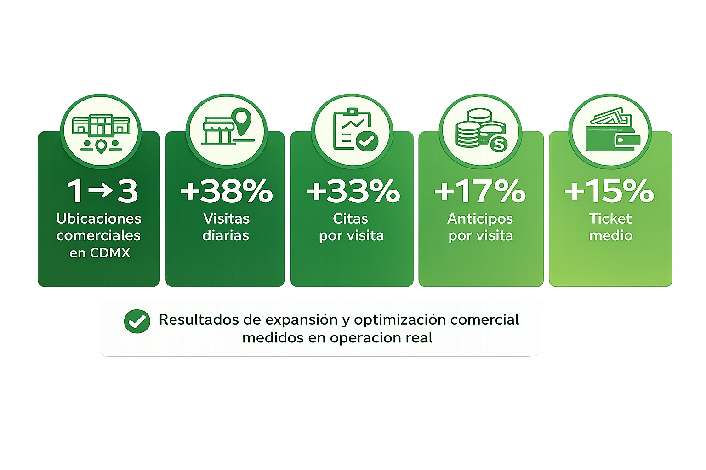

<a href="https://wa.me/525559446719?text=Me%20gustar%C3%ADa%20solicitar%20asesor%C3%ADa%20de%20Expansi%C3%B3n" style="display: inline-block; background-color: #25D366; color: black; padding: 12px 24px; text-decoration: none; border-radius: 8px; font-weight: bold; margin: 20px 0;">Solicitar asesoría de Expansión</a>

## El Cliente

Tendenzza es una empresa de interiorismo con más de 27 años en el mercado, especializada en diseño e instalación de espacios residenciales a medida—cocinas integrales, closets, recámaras y baños. Tras implementar el sistema comercial en la etapa anterior y acelerar el crecimiento en ventas, la empresa inició una expansión en CDMX, pasando de una ubicación en Miramontes a tres puntos comerciales, sumando nuevas aperturas en Colonia del Valle y Pedregal. En esta etapa, el enfoque fue habilitar la expansión desde la ejecución: posicionamiento local, diseño comercial del espacio y operación logística para asegurar consistencia de marca, experiencia premium y tracción comercial en cada ubicación.

## El Reto
### Tráfico que no se convierte en ventas

Estar en una avenida con alto flujo no garantiza clientes. Sin una estrategia comercial clara, el tráfico se queda en “vitrina” y no en cotizaciones y cierres.

### Apertura acelerada que deteriora la percepción de la marca 
Abrir rápido suele implicar improvisación: obra, proveedores, exhibición y operación desalineadas. El riesgo es inaugurar con un showroom “a medias” que daña la marca.

### Nuevas ubicaciones sin posicionamiento en el mercado
Dos ubicaciones nuevas no se vuelven referencia por existir. Sin diferenciación y narrativa, pasan desapercibidas y compiten por precio desde el día uno.

### Rentabilidad incierta y punto de equilibrio que se alarga
La apertura de dos nuevas ubicaciones implica una inversión relevante y un incremento en costos fijos. Sin un plan estratégico para acelerar la llegada al punto de equilibrio, la expansión puede poner en riesgo la operación.

### Diseño en el espacio que no impulsa a la decisión de compra 
Un showroom bonito no necesariamente vende. Si el recorrido, exhibición y zonas de decisión no están diseñadas para cerrar, se pierden oportunidades aunque haya interés.

### Diseño desconectado del cliente de esa zona
Cada ubicación atrae un perfil distinto. Cuando el showroom no está alineado a su ticket, estilo y motivadores, baja la conversión y se complica la venta consultiva.

### Competencia intensa sin diferenciación local
En zonas competidas, “uno más” no sobrevive. Si no destacas por propuesta, experiencia y ejecución, el showroom se vuelve caro de mantener y difícil de escalar.
 
 

# Journey de la Solución
## Diagnóstico de ubicación y benchmark competitivo

Hicimos visitas a competencia, entrevistas, sondeos/encuestas y análisis de zona para identificar qué hace que una locación se perciba premium y convierta mejor. De ahí salieron criterios claros de diseño: *iluminación de alto nivel*, *visibilidad real desde calle* (vitrina/ventanales), un *muestrario dedicado y atractivo* que invite a explorar, y *espacios abiertos* que transmitan amplitud y orden.

## Concepto de diseño y experiencia premium por locación

Con Tendenzza definimos un concepto “premium habitable”: que al entrar se sienta más como una casa bien diseñada que como un local. El equipo tomó referencias de *diseño biofílico del Bellagio* para lograr una atmósfera cálida y sofisticada, manteniendo limpieza visual y protagonismo del producto.

## Arquitectura del espacio y zonificación (recorrido natural)

Convertimos el concepto en un recorrido que guía sin forzar: *Fachada/Vitrina → Estación de diagnóstico → Muestrario → Rutas A/B (Good/Better/Best) → Diferenciadores → Mesa de cierre*. La idea fue que cada zona haga su trabajo: recibir, entender necesidades, mostrar materiales con intención, comparar opciones y llevar a un siguiente paso claro.

## Muestrario como punto fuerte de la experiencia

El benchmark mostró que un muestrario bien diseñado aumenta interés y permanencia. Por ello, se trató como estación principal, no como “muestras en un rincón”: visualmente atractivo y pensado para que el cliente toque, compare y se enganche con el proyecto.

## Diferenciadores estratégicos de diseño

Priorizamos iluminación excepcional desde el diseño para realzar texturas y acabados, aportar calidez, controlar sombras y mantener consistencia en todo el recorrido. La fachada se diseñó para comunicar un nivel premium desde calle y mostrar interiorismo real; en Del Valle se integró un ventanal maximizando exposición a dos calles. Cuidamos coherencia con el edificio y negociamos con locatarios para una fachada unificada que eleva la percepción del conjunto. Se definieron espacios abiertos y sin divisiones para dar amplitud y mejor flujo, asegurando una experiencia premium consistente.

## De concepto a ejecución: proyecto ejecutivo + control de implementación

Aterrizamos todo en especificaciones ejecutables (layout, zonificación, iluminación, criterios del espacio) y visualización (renders) para alinear a todos. Durante la implementación hicimos revisiones y aprobaciones clave para que la obra respetara el concepto, especialmente en iluminación, ventanales, proporciones y fachada.

## Activaciones y alianzas locales 

Complementamos el diseño con un *plan de activaciones* para el arranque y ejecutamos *alianzas locales* con 4 negocios cercanos (intercambio de publicidad in-store) para amplificar exposición alrededor de cada ubicación.

## Operación de apertura alineada al espacio

Ajustamos la operación para que el equipo “use” el diseño: cómo recibir, diagnosticar, guiar por estaciones y cerrar el siguiente paso. Implementamos una variante de los scripts previos adaptada al perfil esperado de cada zona.

## Seguimiento semanal y ajuste fino post-apertura

Operamos seguimiento semanal con el equipo y el dueño para ajustar flujo, uso de zonas, ejecución de activaciones y consistencia de experiencia durante el arranque.

## ¿Qué entregamos?

### Diseño Conceptual + Distribución Funcional

•⁠  ⁠Concepto alineado a la marca con experiencia premium habitable e inspiración biofílica

•⁠  ⁠Paleta de colores y selección de acabados para consistencia visual y percepción de alto nivel

•⁠  ⁠Zonificación estratégica del espacio y distribución funcional con recorrido claro

•⁠  ⁠Muestrario diseñado como estación protagónica para exploración y conversación de proyecto

•⁠  ⁠Plan de iluminación definido desde el concepto para realce de materiales y atmósfera premium

•⁠  ⁠Levantamiento en sitio con fachada y registro fotográfico para diseñar sobre condiciones reales

### Proyecto Ejecutivo + Integraciones en Fachada

•⁠  ⁠Planos arquitectónicos completos, incluyendo plantas, cortes y alzados

•⁠  ⁠Diseño de fachada con selección de materiales e iluminación para lectura premium desde calle

•⁠  ⁠Integración de fachada con el edificio y coordinación con locatarios para lograr una fachada unificada

•⁠  ⁠Detalles constructivos para ejecución consistente y control de calidad en obra

•⁠  ⁠Planos de instalaciones eléctricas y plomería integrados al funcionamiento del espacio

•⁠  ⁠Ajuste de exposición en Del Valle con ventanal adicional para mejorar visibilidad hacia dos calles

### Renders 6 vistas

•⁠  ⁠Seis imágenes fotorrealistas con modelado 3D incluido

•⁠  ⁠Cuatro vistas interiores para validar materialidad, iluminación y experiencia

•⁠  ⁠Una vista isométrica general para lectura de layout y zonificación

•⁠  ⁠Una vista de fachada para validar exposición desde calle y coherencia con el entorno

### Estudio de mercado a profundidad

•⁠  ⁠Visitas a competencia para identificar estándares premium en iluminación, presentación y experiencia

•⁠  ⁠Entrevistas, sondeos y encuestas para entender expectativas y objeciones típicas del cliente por zona

•⁠  ⁠Análisis de zona para ajustar la apertura al contexto real de cada ubicación

•⁠  ⁠Hallazgos traducidos a decisiones de diseño concretas, con foco en iluminación, visibilidad, ventanales y un muestrario dedicado

### Plan de activaciones

•⁠  ⁠Calendario ejecutable para lanzamiento y primeras semanas de operación

•⁠  ⁠Acciones diseñadas para generar tráfico calificado y sostener tracción inicial

•⁠  ⁠Integración del plan con la operación en piso para ejecución consistente

### Alianzas locales

•⁠  ⁠Alianzas con cuatro negocios cercanos mediante intercambio de visibilidad y promoción in store

•⁠  ⁠Criterios de exhibición y ejecución para mantener percepción premium

•⁠  ⁠Integración de alianzas al arranque para amplificar exposición local desde el día uno

### Ajuste operativo para la apertura

•⁠  ⁠Variante de atención y scripts adaptados al perfil esperado de cada ubicación

•⁠  ⁠Guía de operación alineada al diseño para aprovechar estaciones y recorrido, incluyendo el Muestrario
•⁠  ⁠Estándares de ejecución para consistencia desde el arranque

### Supervisión de implementación con revisiones y verificaciones clave

•⁠  ⁠Seguimiento semanal con el equipo y el dueño para coordinación y ajustes en tiempo real

•⁠  ⁠Verificaciones críticas en iluminación, fachada, ventanales, proporciones y zonas clave

•⁠  ⁠Aprobaciones y control de ejecución para asegurar que lo construido refleje el estándar diseñado

### Obra y ejecución en sitio

•⁠  ⁠Gestión integral de obra para materializar el proyecto, no solo supervisión

•⁠  ⁠Coordinación de contratistas y frentes de trabajo para ejecutar el layout, instalaciones y acabados conforme a planos

•⁠  ⁠Participación directa en revisiones clave en sitio y toma de decisiones durante construcción

•⁠  ⁠Control de calidad de acabados, fachada e iluminación para asegurar el estándar premium del diseño

•⁠  ⁠Validación en campo de elementos críticos, incluyendo aperturas y ventanales, lectura de fachada y escenas de iluminación

## ¿Estas pensando en expandirte de manera estructurada, tactica y replicable?

<a href="https://wa.me/525559446719?text=Me%20gustar%C3%ADa%20solicitar%20asesor%C3%ADa%20de%20Expansi%C3%B3n" style="display: inline-block; background-color: #25D366; color: black; padding: 12px 24px; text-decoration: none; border-radius: 8px; font-weight: bold; margin: 20px 0; min-width: 220px; text-align: center;">Solicitar asesoría de Expansión</a>
<a href="https://wa.me/525559446719?text=Hola%2C%20me%20gustar%C3%ADa%20hablar%20con%20un%20consultor..." style="display: inline-block; background-color: #9e9e9e; color: black; padding: 12px 24px; text-decoration: none; border-radius: 8px; font-weight: bold; margin: 20px 0; min-width: 220px; text-align: center;">Hablar con un Consultor</a>

