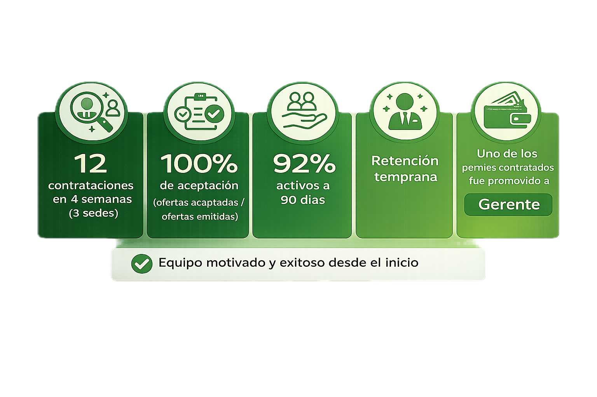

<a href="https://wa.me/525559446719?text=Me%20gustar%C3%ADa%20solicitar%20informaci%C3%B3n%20sobre%20los%20planes%20de%20contrataci%C3%B3n" style="display: inline-block; background-color: #25D366; color: black; padding: 12px 24px; text-decoration: none; border-radius: 8px; font-weight: bold; margin: 20px 0;">Solicitar Plan de Contratación7</a>

## El Cliente

Tendenzza es una empresa de interiorismo con más de 27 años en el mercado, especializada en diseño e instalación de espacios residenciales a medida—cocinas integrales, closets, recámaras y baños. Tras abrir nuevas sedes en CDMX (Miramontes, Pedregal y Colonia del Valle), la necesidad de personal nuevo para la empresa se volvió crucial, en esta etapa Inner Circle implementó una solución para encontrar/evaluar y capacitar al nuevo personal. Inner circle está seguro que el personal de una empresa es un factor determinante para su éxito.

## El Reto

### Contratar “rápido” sin contratar “mal”

La presión por cubrir posiciones empuja a decisiones por urgencia. Eso suele traducirse en un mal empleado, rotación y meses perdidos reiniciando el proceso.

### Perfiles difíciles de validar en entrevista

Muchos candidatos se ven bien en CV y hablan bien en entrevista, pero fallan en ejecución: criterio débil, bases técnicas insuficientes, baja estructura mental o poca disciplina.

### Entrevistas subjetivas que no predicen desempeño

Cuando la selección depende de “me dio buena espina”, se cuelan perfiles con discurso fuerte pero hábitos y habilidades inconsistentes. El costo aparece después: errores, fricción interna, clientes mal atendidos y curva lenta.

### Curva de aprendizaje lenta (y costosa) al entrar

Incluso un buen candidato se puede perder si entra sin estructura: sin estándares claros, sin herramientas y sin objetivos claros en el trabajo real, el capacitar se vuelve tardado y confuso.

### Inconsistencia en la ejecución del equipo

Sin un proceso único de selección y capacitación inicial, cada líder contrata y entrena distinto. El resultado es un equipo con estándares disparejos, más retrabajo y ejecución impredecible.

### Falta de metodología de Contratación

Sin un proceso medible, la contratación se vuelve una apuesta: no sabes cuántas vacantes realmente necesitas cubrir, cuántos candidatos debes atraer para llenar cada posición, ni en qué etapa se te están cayendo. El resultado es contratar a ciegas, tarde y con urgencia.

 
 

# Journey de la Solución

## Entender necesidad del puesto a cubrir

Antes de buscar candidatos, nos metimos a fondo en la necesidad del puesto: estuvimos en piso, observamos el trabajo real, los retos del día a día y las habilidades que sí o sí se requieren, alineamos con Dirección el perfil ideal (nivel de estudios, capacitación, competencias técnicas y estilo de trabajo) y nos sumergimos en la cultura de la empresa para asegurar que el estándar de selección fuera consistente con la operación. 

## Atracción multicanal con mensaje diseñado para filtrar

Desplegamos reclutamiento en plataformas, comunidades y universidades, con un mensaje construido para atraer perfiles con mentalidad de resultados y profesionalismo, y al mismo tiempo filtrar candidatos que no encajan con un entorno exigente. 

## Filtro inicial para identificar debilidades clave

Implementamos un corte rápido para eliminar perfiles con brechas claras en fundamentos, criterio o estructura. Este paso protege tiempo de entrevistas y evita avanzar candidatos que inevitablemente se caerán más adelante.

## Entrevista estructurada con matriz de evaluación 

Estandarizamos entrevistas con una guía y una *matriz de evaluación* para calificar a todos con los mismos rubros: comunicación, presencia profesional, pensamiento estructurado, resolución de problemas, dominio técnico del rol, disciplina y ejecución. Así logramos comparabilidad real entre candidatos y reducimos decisiones basadas en “buena impresión”.

## Pruebas prácticas (evidencia de capacidad real)

Para evitar contratar solo por discurso, integramos una prueba práctica alineada al rol: un caso con restricciones y entregables claros que permite observar cómo piensa el candidato, cómo estructura, cómo decide y qué tan preciso es. Esto separa rápido a quien “se ve bien” de quien realmente ejecuta.

## Evaluaciones complementarias + validación con referencias

Se integraron evaluaciones psicométricas y validaciones con referencias/aliados del sector para confirmar hábitos, consistencia y experiencia real. Este paso reduce riesgo y refuerza la decisión final con evidencia externa.

## Selección y cierre de candidatos (retener a los mejores)

Los perfiles más fuertes suelen estar en varios procesos al mismo tiempo. Por eso, además de seleccionar con rigor, cerramos a los candidatos resolviendo objeciones típicas con claridad y rapidez (expectativas del rol, horarios, crecimiento y forma de trabajo), para asegurar compromiso y evitar que se vayan con otra oferta.

## Paquete de decisión para Dirección (todo en un solo lugar)

Entregamos una lista corta por vacante con los mejores candidatos ya evaluados. Para cada uno compartimos: el video de la entrevista, un resumen con lo más importante y un archivo en Excel con calificaciones por criterio (por ejemplo: diseño, comunicación y ejecución). Además, aplicamos una prueba técnica práctica para ver cómo trabajan en la vida real antes de tomar la decisión.

## Capacitación práctico con validación (habilitación real)

Una vez dentro, capacitamos con enfoque práctico: herramientas, estándares, checklist, role plays y ejecución supervisada. El candidato no se libera por “asistir”, se libera por demostrar competencia en escenarios reales.

## Reunión semanal con Dirección 

Tuvimos una reunión semanal con Dirección para revisar avances, destrabar decisiones y ajustar el proceso cuando era necesario (qué perfiles seguir, cuáles descartar y qué cambiar en la búsqueda). Esto evitó retrasos, mantuvo el ritmo de contratación y cuidó que la calidad no bajara por la urgencia.

## Cierre de la etapa y transferencia

Cerramos con una sesión formal para confirmar decisiones finales, revisar qué funcionó y qué ajustar, y dejar responsables y rutina de seguimiento definidos. Entregamos la metodología y herramientas (criterios, etapas, plantillas y matriz de evaluación) para que el cliente pueda repetir el proceso con el mismo estándar, sin depender de Inner Circle.

---

## ¿Qué entregamos?

### Definición del rol y estándar de selección

•⁠ Perfil de éxito con criterios no negociables y señales de alerta (lo que sí / lo que no)

•⁠⁠Estandarización del rol: expectativas, habilidades, nivel técnico mínimo y comportamientos esperados

•⁠ ⁠Criterios de evaluación basados en ejecución real, no solo en CV

### Atracción y despliegue multicanal

•⁠  ⁠Mensaje de vacante diseñado para atraer perfiles correctos y filtrar desde el inicio

•⁠  ⁠Búsqueda multicanal (plataformas, comunidades y universidades) con cobertura y seguimiento

•⁠  ⁠Gestión de candidatos para mantener ritmo y calidad (registro, avance por etapa y control de respuesta)

### Evaluación estructurada (entrevista con matriz de evaluación)

•⁠  ⁠Guía de entrevista por bloques para evaluar de forma consistente

•⁠  ⁠Matriz de evaluación en Excel con calificaciones por rubro (p. ej., comunicación, estructura, ejecución, técnica)

•⁠  ⁠Criterios de corte y avance por etapa para reducir subjetividad

### Prueba práctica por rol (evaluación con evidencia)

•⁠  ⁠Caso práctico con restricciones y entregables definidos para probar desempeño real

•⁠  ⁠Rúbrica de evaluación para calificar calidad de solución, precisión y criterio

•⁠  ⁠Resultados comparables entre candidatos para decidir con rapidez

### Validaciones complementarias

•⁠  ⁠Pruebas psicométricas como apoyo a la lectura del perfil

•⁠  ⁠Validación de referencias con red/aliados de la industria para reducir riesgo de mal ajuste

•⁠  ⁠Lista de verificación previa a oferta (confirmaciones clave antes de cerrar)

### Capacitación inicial y habilitación operativa

•⁠  ⁠Capacitación inicial con herramientas, estándares y listas de verificación

•⁠  ⁠Práctica con simulaciones y ejercicios para asegurar ejecución (no solo teoría)

•⁠  ⁠Validación en piso: role plays y atención supervisada antes de operar de forma independiente

### Paquete de decisión para Dirección (todo en un solo lugar)

•⁠  ⁠Lista corta por vacante con candidatos ya filtrados y evaluados

•⁠  ⁠Video de entrevistas + resumen con puntos clave por candidato

•⁠  ⁠Archivo en Excel con calificaciones por criterio para comparar de forma objetiva

•⁠  ⁠Resultados de la prueba práctica anexados a la evaluación de cada candidato

•⁠  ⁠Repositorio en SharePoint con el CV y portafolio de todos los candidatos (centralizado y fácil de revisar)

### Reunión semanal con Dirección (para destrabar y mantener el estándar)

•⁠  ⁠Revisión semanal de avances, prioridades y decisiones pendientes

•⁠  ⁠Ajustes a búsqueda y filtros según calidad y disponibilidad de candidatos

•⁠  ⁠Control de ritmo y calidad para evitar retrasos y contrataciones por urgencia

---

## ¿Estás contratando y no puedes darte el lujo de equivocarte?

<a href="https://wa.me/525559446719?text=Me%20gustar%C3%ADa%20solicitar%20informaci%C3%B3n%20sobre%20los%20planes%20de%20contrataci%C3%B3n" style="display: inline-block; background-color: #25D366; color: black; padding: 12px 24px; text-decoration: none; border-radius: 8px; font-weight: bold; margin: 20px 0; min-width: 220px; text-align: center;">Solicitar Plan de Contratación</a>
<a href="https://wa.me/525559446719?text=Hola%2C%20me%20gustar%C3%ADa%20hablar%20con%20un%20consultor..." style="display: inline-block; background-color: #9e9e9e; color: black; padding: 12px 24px; text-decoration: none; border-radius: 8px; font-weight: bold; margin: 20px 0; min-width: 220px; text-align: center;">Hablar con un Consultor</a>

